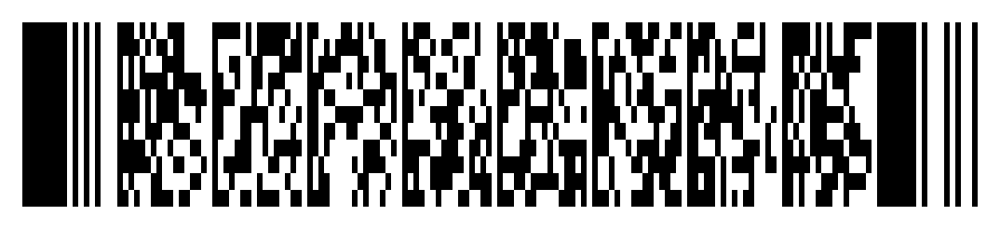

# moonbit-pdf417

**MoonBit 从零实现的 PDF417 二维条码编解码器，纯 MoonBit、零第三方依赖、跨 wasm／js／native 结果一致。**

<table>
<tr><td align="center">
<br>
<sub><code>encode text:https://github.com/ouoankang/moonbit-pdf417 --columns 6 --ec-level 4</code><br>
上面这张图由本项目生成，已用 zxing-cpp 扫回原字符串（见 <code>scripts/gen_samples.py</code>）</sub>
</td></tr>
</table>

[](https://www.moonbitlang.com/)
[](LICENSE)

| 指标 | 结果 |
| --- | --- |
| 与独立参考实现的一致性向量 | **127 / 127（100%）** |
| 单元测试 | **202 / 202 通过**（wasm 目标，零警告） |
| 工业解码器 zxing-cpp 读回 | **23 / 23 张符号全部解出原载荷** |
| 随机载荷往返（fixed seed） | **110 条全过**，40 条被几何规则正确拒绝，0 条错误 |
| 模块级错误注入恢复 | **23 / 23 全恢复**，含注满纠错容量 |
| 纠错系数与 ISO/IEC 15438 表 | 9 个级别**全部一致**（系数由 `∏(x − 3^i)` 现算，非抄表） |
| 符号字符图案表自检 | **2787 / 2787** 条结构合法 |
| 手写 MoonBit 源码 | 约 2 570 行（不含生成表与测试） |

---

## 一句话定位

PDF417 是 ISO/IEC 15438 定义的**堆叠式二维条码**：用 3～90 行、1～30 列的符号字符
拼出一个可被激光／影像扫描器读取的矩形码，每行都重复承载符号几何信息，整块数据
外面套一层 GF(929) 上的 Reed-Solomon 纠错。它印在身份证、机票、物流面单和
各类票据上，特点是**容量大、可局部损坏后仍能读出、不需要对准**。

MoonBit 生态里已经有不错的**一维**条码库（`fan-ere/moonbarcode` 覆盖 EAN／UPC／
Code 39／Code 93／Code 128／ITF-14，`Qlcdsba/moonbit-barcoder` 是 GS1-128 数据解析），
也有若干 QR 码实现，但**二维条码中的 PDF417 没有任何实现**：在 mooncakes.io 上按
`pdf417`、`iso15438`、`2d barcode`、`datamatrix` 检索均为 0 结果（2026-09-25 实测）。

本项目补的就是这一格：一个把「字节 → 码字 → 符号字符 → 模块矩阵」整条链路做完，
并且**能把矩阵再解回字节**的纯 MoonBit 实现。

---

## 目录

- [这个项目解决什么问题](#这个项目解决什么问题)
- [与现有 MoonBit 实现的差异](#与现有-moonbit-实现的差异)
- [快速开始](#快速开始)
- [在代码里用](#在代码里用)
- [验收：四层可复现的证据](#验收四层可复现的证据)
- [项目结构](#项目结构)
- [几个值得说的实现点](#几个值得说的实现点)
- [已知限制](#已知限制)
- [第三方资源与许可](#第三方资源与许可)
- [AI 辅助说明](#ai-辅助说明)

---

## 这个项目解决什么问题

要生成一个 PDF417 符号，光有「画个二维码」是不够的，得把标准里的四层依次做对：

1. **压缩**（compaction）——同一段数据可以有三种编码方式，选错一种只是变大，
   选错边界则直接产生**能扫但内容是错的**符号。文本模式按 30 进制两字符一码字，
   字节模式把 6 字节压成 5 个码字，数字模式把 44 位数字压进 15 个码字。
2. **纠错**——在 GF(929) 上做 Reed-Solomon。这个域不是常见的 GF(2^n)，
   生成多项式是 `g(x) = ∏(x − 3^i)`，系数要按标准表对齐。
3. **布局**——把码字按列数切行、补填充码字、每行两侧各放一个**行指示符**
   （重复行数、列数、纠错级别），并让行的簇号按 0/3/6 循环。
4. **渲染**——每个符号字符是 17 个模块（4 条 4 空，每段 1～6 模块），
   起始图案 17 模块、终止图案 18 模块，外加静区。

任何一层做错，产出的都是一张**看起来很像条码、扫出来是垃圾**的图。所以本项目的
重点不在「能画出图」，而在**每一层都有独立的证据**。

反过来，解码要解决的是同一件事的逆问题，外加一个真实存在的坑：**长度描述符本身
是被纠错保护的**。先读它再纠错，一个被损坏的码字就能让解出的载荷被静默截断——
这个 bug 本项目实际踩到过，见[实现点 4](#4-长度描述符必须在纠错之后读)。

---

## 与现有 MoonBit 实现的差异

| 项目 | 定位 | 与本文的关系 |
| --- | --- | --- |
| `fan-ere/moonbarcode` | **一维**条码生成与校验（EAN/UPC/Code 39/93/128/ITF-14） | 一维，符号结构与 PDF417 完全不同 |
| `Qlcdsba/moonbit-barcoder` | GS1-128 / Code 128 数据解析工具 | 解析而非编码，且仍是一维 |
| `bobzhang/qrc` 等 QR 实现 | QR 码编码 | QR 用的是 GF(256) 与掩码选择，与 PDF417 的 GF(929) 无关 |
| **本项目** | PDF417 编**与**解，含行指示符恢复与 Reed-Solomon 纠错 | — |

一个可验证的差异点：本项目的输出能被 zxing-cpp（Google ZXing 的 C++ 实现）
解码回原载荷，包括 6／7／11／17 字节这类会落到字节压缩边界的载荷；
`scripts/verify_zxing.py` 一条命令复现。

---

## 快速开始

### 1. 装 MoonBit 工具链

Linux / macOS：

```sh
curl -fsSL https://cli.moonbitlang.com/install/unix.sh | bash
export PATH="$HOME/.moon/bin:$PATH"
```

Windows 见 [MoonBit 官网安装说明](https://www.moonbitlang.com/download/)。

### 2. 跑测试

```sh
moon check          # 零警告
moon test           # 202 个测试
```

### 3. 生成一个条码

命令行是「参数进、stdout 出」，不读文件、不需要 FFI，所以整仓 `--target all`
都能构建。js 目标是因为它要从 `process.argv` 取参数：

```sh
# 终端里直接看（# 是条，. 是空）
moon run --target js cmd/main -- encode text:hello --columns 3 --ec-level 2

# 输出可扫描的 SVG
moon run --target js cmd/main -- encode text:hello --columns 3 --ec-level 2 \
  --format svg --scale 3 > hello.svg

# 输出 PBM 位图（ImageMagick / Pillow 都能读）
moon run --target js cmd/main -- encode hex:00ff10 --format pbm > raw.pbm
```

把 `text:` 换成 `hex:` 就能编码任意字节。默认列数 6、纠错级别 2；
`--columns 1..30`、`--ec-level 0..8`。

再看一下这个符号的内部结构：

```sh
$ moon run --target js cmd/main -- info text:"Order 100000000000 shipped"
payload bytes  : 26
mode segments  : text:4, numeric:12, text:8
data codewords : 18
ec codewords   : 8
rows           : 6
columns        : 6
modules        : 171 x 6
dark modules   : 421
```

`mode segments` 就是压缩层的决策结果：4 个文本字节、12 位数字（长到值得用数字
压缩）、再 8 个文本字节。

### 4. 解回来

把 `--format text` 的输出原样喂回 `decode` 即可（两者用同一种网格表示）：

```sh
moon run --target js cmd/main -- encode text:hello --columns 3 --format text
moon run --target js cmd/main -- decode --matrix "####;....;..."
```

```text
$ moon run --target js cmd/main -- decode --matrix "<...>"
payload        : hello
bytes          : 68656c6c6f
rows x columns : 3 x 3
ec level       : 2
length descr.  : 3
indicators     : rows=3 columns=3 ec=2
unmatched      : 0
corrected      : 0
```

`unmatched` 是「17 个模块没能精确匹配任何一个符号字符」的个数，
`corrected` 是 Reed-Solomon 实际修正的码字数——两者分开，因为**整字符被替换**
时图案仍然精确匹配（`unmatched` 为 0）而码字是错的，**位级划伤**则反之。

### 5. 一次自检

```sh
moon run --target js cmd/main -- selfcheck
```

对一个内置语料做完整的 encode → decode 往返，逐条打印几何参数。

### 6. 在浏览器里试

```sh
python scripts/build_web.py                        # 编译成单个 JS
python -m http.server 8080 --directory web
# 打开 http://localhost:8080/
```

页面把编码与解码都暴露出来，全部在浏览器里跑，不发网络请求：
左边输入载荷就能拿到可扫的 SVG，右边把「终端网格」粘回去就能解出字节。
`scripts/check_web.mjs` 用 Node 加两个桩全局变量跑同一份产物，
覆盖了每种输出格式与一次完整往返——不用浏览器也能发现 FFI 接线断了。

---

## 在代码里用

库本体（`src/pdf417`）与平台无关，在 `wasm` 上跑全部单元测试。

```moonbit
// 编码
let symbol = try! @pdf417.encode("hello, 世界", @pdf417.EncodeOptions::new(6, 3))
println(symbol.rows())              // 行数
println(symbol.matrix().width())    // 模块宽度 = 17 * columns + 69
println(@pdf417.to_svg(symbol.matrix(), @pdf417.RenderOptions::default()))

// 解码：把矩阵解回字节（不经过字符串，二进制载荷无损）
let decoded = try! @pdf417.decode_matrix(symbol.matrix())
println(decoded.payload())                       // "hello, 世界"
println(decoded.bytes().length())                // UTF-8 字节数
println(decoded.report().corrected_errors())     // 修正了几个码字
println(decoded.report().indicator_rows())       // 行指示符独立读出的行数
```

需要原始字节就传 `Array[Int]`：

```moonbit
let symbol = try! @pdf417.encode_bytes([0x00, 0xFF, 0x10], @pdf417.EncodeOptions::new(3, 2))
```

渲染有三种输出，都不写文件：

```moonbit
@pdf417.to_pbm(symbol.matrix(), render)              // P1 位图，一行一样本
@pdf417.to_svg(symbol.matrix(), render)              // 暗模块按水平游程合并
symbol.matrix().to_text("#", ".")                    // 终端里看
```

**只做文本格式是有意的**：转 PNG／GIF 属于图像库的职责，一行 shell 就能接上，
放进条码编解码器只会模糊边界。

---

## 验收：四层可复现的证据

四层证据相互独立，都不依赖网络。前两层由 `moon test` 覆盖，后两层各有一条命令。

### 1. 与独立参考实现的一致性（127 / 127）

`tests/vectors/pdf417_vectors.json` 里的向量由 **pdf417gen 0.8.1**（MIT，一个
独立的 Python 实现）生成，每个用例固定三样东西：

- **高层码字流**——长度描述符、数据、填充、纠错码字的完整序列；
- **模块网格摘要**——按行优先扫描整个矩阵的多项式散列；
- **行数**。

同样的输入喂给本实现，逐条比对。这条链路同时压住了压缩、纠错和布局三层，
任何一层算错都会让码字或摘要对不上。

```sh
moon test
# 含 127 条 conformance/* 用例
```

生成方式与来源见 `tests/VENDORED.md`，重跑命令是
`python scripts/gen_vectors.py`。

### 2. 纠错层的穷举验证

- **生成多项式**：`generator_coefficients(level)` 由 `g(x) = ∏(x − 3^i) mod 929`
  现算，9 个级别的系数与 ISO/IEC 15438 公布的系数表**逐项一致**
  （`ec_coefficients_test.mbt`，共 1022 项）。
- **单码字错误穷举**：级别 2 的块里，对**每个位置**注入**每个量级**的错误
  （12 个位置 × 26 个量级 = 312 组），全部被正确修复且块内每一个码字都复原。
- **容量边界**：级别 3 注满 8 个错误、级别 4 注满 16 个错误仍全部修复；
  **超出容量则明确报错**而不是猜一个结果（`ec_wbtest.mbt`）。
- **域公理**：929 个元素的加法逆元、乘法逆元、分配律，以及 3 是阶为 928 的
  本原元（`gf929_wbtest.mbt`）。

### 3. 端到端往返与错误注入

```sh
python scripts/verify_roundtrip.py
```

- 按固定种子生成文本／数字／纯字节／多字节字符混合载荷，覆盖 1..30 列与
  0..8 纠错级别，逐条 encode → decode 比对。
- **错误注入用的是真符号错误**：把某个符号字符的 17 个模块整体换成**另一个码字**
  的图案（图案表从生成的 `codeword_table.mbt` 读出），然后要求解码器
  ①载荷完好 ②报告里修好的错误数等于注入数。
- 几何非法的请求（行数不足 3、列数越界）被正确拒绝，单独计数。

### 4. 工业解码器读得出来

```sh
python scripts/verify_zxing.py      # 需要 pip install zxing-cpp pillow numpy
python scripts/gen_samples.py       # 顺便重新生成 docs/assets 里的示例图
```

把本项目的 PBM 输出交给 **zxing-cpp**（Google ZXing 的 C++ 实现，被大量生产系统
使用）解码，再比回原始字节。语料覆盖 ASCII、中文、emoji、纯字节、
6／7／11／17／24 字节（字节压缩的边界长度）、1 列到 30 列、纠错级别 0 到 8。

第 3、4 层需要 Python，不进仓库依赖；`moon test` 本身完全离线。

---

## 项目结构

```text
.
├── src/pdf417/
│   ├── types.mbt           公共类型：CompactionMode、EncodeOptions、RenderOptions、
│   │                       BitMatrix、结构化错误 Pdf417Error
│   ├── gf929.mbt           GF(929) 域运算
│   ├── ec.mbt              Reed-Solomon：生成多项式、编码、伴随式、多项式求值
│   ├── compact.mbt         三种压缩模式与分段决策
│   ├── layout.mbt          码字组装、行指示符、填充、模块网格
│   ├── render.mbt          PBM / SVG / 终端文本
│   ├── decode.mbt          图案匹配、行指示符投票、Berlekamp-Massey + Forney、逆压缩
│   ├── hex.mbt             十六进制编解码
│   ├── codeword_table.mbt  生成物：929 × 3 符号字符图案表
│   ├── text_table.mbt      生成物：文本子模式表与切换码
│   └── *_test.mbt / *_wbtest.mbt
├── cmd/
│   ├── main/               CLI：encode / decode / info / selfcheck
│   └── web/                浏览器入口：把 API 挂到 globalThis
├── tests/vectors/          随仓库版本化的一致性向量与纠错系数表
├── scripts/
│   ├── gen_codeword_table.py   生成图案表与文本表，并核对纠错系数
│   ├── gen_vectors.py          从 pdf417gen 生成一致性向量
│   ├── verify_roundtrip.py     随机往返 + 错误注入
│   ├── verify_zxing.py         交给 zxing-cpp 解码
│   ├── gen_samples.py          重新生成 docs/assets 并验证可扫
│   ├── build_web.py            编译浏览器产物
│   └── check_web.mjs           用 Node 冒烟测试该产物
├── web/
│   ├── index.html          在线试用页（编码 + 解码）
│   ├── pdf417.js           构建产物，随仓库版本化以便静态托管
│   └── README.md
└── docs/
    ├── assets/             README 里那几张条码
    ├── DECODING.md         解码链路逐步说明
    └── DEVELOPMENT.md      开发历程：绕过哪些弯路、为什么这么取舍
```

---

## 几个值得说的实现点

下面这几处都是**写错了不会报错、只会静默给出错误结果**的地方。

### 1. 字节压缩段的边界，是「码字 ≥ 900」

字节压缩把 6 个字节压成 5 个码字，但短于 6 字节的尾巴直接按字面字节写入。
解码时要回答一个问题：**这一段的 5 个码字，是「一个 sixpack」还是「5 个字面字节」？**

规则是：累加最多 5 个码字，遇到 ≥ 900 的码字就停；只有恰好凑满 5 个，
且（用的是 924 锁存）或（后面还有 < 900 的码字）时，才转换成一个 sixpack。
否则回退，按字面字节读。

这条规则同时解释了**填充码字为什么是 900**：它就是文本锁存码，落在字节段末尾
时会终止该段而不会被当作数据。一个 6 字节的载荷恰好 5 个码字，用的是 924 而不是
901——901 留给「长度不是 6 的倍数」的情况。`scripts/verify_zxing.py` 里
6／7／11／17 字节这几个用例就是钉这条边界的。

### 2. 32 位 `Int` 会在字节压缩里静默回绕

5 个 base-900 码字最大是 `900^5 ≈ 5.9e14`，6 个字节需要 48 位。MoonBit 的
`Int` 是 32 位，所以解码侧的累加器必须是 `Int64`：

```moonbit
let mut value : Int64 = 0L
while count < 5 && words[i] < latch_text {
  value = 900L * value + words[i].to_int64()
  ...
}
```

这个 bug 的现象很有欺骗性：**载荷长度对、内容从第 7 个字节起整体偏移**，
一眼看过去像是「某个表错了一位」。编码侧不受影响，因为那边是逐位长除法
（每步的中间量都小于 900 × 256），同一件事用两种写法，只有一种会溢出。

### 3. 多项式求值的方向搞混，结果是静默的

码字块按「最高次在前」书写，所以伴随式计算用降幂 Horner：

```moonbit
pub fn poly_eval(coeffs : Array[Int], x : Int) -> Int {
  // c(x) = c[0] * x^(n-1) + ... + c[n-1]
}
```

但错误定位多项式 `σ(x)` 与错误求值多项式 `Ω(x)` 是**升幂**的，必须换一个方向求值：

```moonbit
pub fn poly_eval_asc(p : Array[Int], x : Int) -> Int {
  let mut i = p.length() - 1
  while i >= 0 { acc = gf_add(gf_mul(acc, x), p[i]); i = i - 1 }
}
```

用错方向不会崩：算出来的仍然是域里的一个数，只是不是想要的那个。现象是
「纠错什么都不修，或者把已经正确的块改坏」。所以这两个函数在源码里紧挨着放，
注释互相指认。

### 4. 长度描述符必须在纠错之后读

`decode` 的第一个码字是长度描述符，它决定数据区有多少码字。**它本身也是被纠错
保护的**，所以顺序只能是：读行指示符拿到纠错级别 → 纠错 → 再读长度描述符。

反过来的写法（先读描述符再纠错）在干净符号上完全正确，只有在描述符恰好被打坏时
才暴露，而且暴露得很脏：Reed-Solomon 明明把所有错误都修好了（`corrected=4`），
载荷却被截断成一半。这是本项目开发中被错误注入测试抓出来的真 bug，
回归测试见 `decode_test.mbt` 的 `decode/damaging the length descriptor ...`。

顺带一提，纠错级别必须来自**行指示符**而不是数据：几何信息是重复冗余的，
数据不是。解码器因此不对「级别未知」做猜测，读不到行指示符就直接报错。

### 5. 行指示符按多数表决，而不是取第一个能读的

每一行都重复两个几何量（行数、列数、纠错级别），簇号决定是哪两个。取「第一个能
精确匹配的行指示符」是错的——一行被打坏时它仍然可能匹配到**另一个合法图案**，
给出一个看起来正常的错值。本项目的做法是对全部行做多数表决：

```moonbit
let rows_votes : Array[Int] = Array::make(30, 0)
// ... 逐行读取，精确匹配才计票
let rows_x = winner(rows_votes)
```

只有精确匹配才投票，近似匹配当作损伤不计——这正是「重复」这个设计存在的意义。

### 6. 数字压缩的分组大小由 900^15 决定

一个数字压缩分组最多 44 位数字，理由是算术：分组值会带上一个前导 `1`
（保护前导零），所以 44 位数字对应 45 位数；而 `900^14 ≈ 2.29e41`、
`900^15 ≈ 2.06e44`，45 位数正好需要**恰好 15 个码字**，不多不少。

编码器按 44 位切分，解码器就能从前往后每 15 个码字切一组——**只有最后一组**
可能不足 15 个，且它后面不会再有分组。这一条在 `compact_wbtest.mbt` 里用
41／42／43／44 位四个长度钉住了边界。

---

## 已知限制

诚实列出来，都是有意的边界而非遗漏：

1. **解码器的输入是「逻辑模块矩阵」，不是照片。** 从一张图里找到条码、二值化、
   纠正透视与倾斜，是扫描器的问题（阈值、行列检测、透视变换），不属于条码编解码
   器；把它塞进来只会让「本项目到底保证了什么」变模糊。解码器处理的是码字层：
   图案匹配、几何恢复、Reed-Solomon 纠错。
2. **只做 PDF417，不含其他二维码制。** MicroPDF417、DataMatrix、Aztec、
   MaxiCode 都不在范围内。
3. **渲染只有 PBM / SVG / 终端文本**，不出 PNG／JPEG 等压缩位图（理由见上）。
4. **CLI 走 js 后端**，因为它从 `process.argv` 取参数；库本体与后端无关，
   在所有后端通过测试。
5. **不带 ECI 与宏 PDF417 的扩展语义。** 载荷按 UTF-8 字节编码与还原，
   非 UTF-8 的字节序列可以取回原始字节（`Decoded::bytes()`），但不会自动做字符集转换。
6. **纠错容量是硬的。** 超出 `2^(level+1)/2` 个码字错误时明确抛错，
   不做「尽量猜」——对条码来说，猜错的代价高于读不出。

---

## 第三方资源与许可

本项目以 **Apache-2.0** 发布，见 [LICENSE](LICENSE)。

随仓库包含的第三方资源：

| 资源 | 用途 | 许可 |
| --- | --- | --- |
| [pdf417gen](https://github.com/mmulqueen/pdf417gen) 0.8.1 | 生成一致性向量（`tests/vectors/pdf417_vectors.json`）与纠错系数对照表 | MIT，原文见 `tests/vectors/LICENSE.pdf417gen` |
| ISO/IEC 15438 的符号字符图案表 | `src/pdf417/codeword_table.mbt`（生成物）。标准将其定义为规范性数据表而非闭式规则，故以数据形式入库 | 标准的表格内容，整理过程对照 pdf417gen |
| ISO/IEC 15438 的文本子模式表 | `src/pdf417/text_table.mbt`（生成物） | 同上 |
| [zxing-cpp](https://github.com/zxing-cpp/zxing-cpp) | **仅**被 `scripts/verify_zxing.py` 调用，用于验证输出可被真实解码器读取；不进入构建、不进入运行时 | Apache-2.0 |

`tests/VENDORED.md` 记录了这些资源的来源、版本与快照方式。

---

## AI 辅助说明

本项目的代码与文档在 AI 助手（WorkBuddy）的辅助下完成。过程可追溯、结论可复现，
具体如下：

- **生成物都带生成脚本。** `codeword_table.mbt` 与 `text_table.mbt` 由
  `scripts/gen_codeword_table.py` 生成，`pdf417_vectors_test.mbt` 与
  `ec_coefficients_test.mbt` 由生成脚本产出，重跑一条命令即可复现。
- **每条结论都有对应的验证命令。** 一致性成绩用 `moon test` 复现；
  错误注入与随机往返用 `python scripts/verify_roundtrip.py`；
  工业解码器验证用 `python scripts/verify_zxing.py`。
- **AI 写错的每一处都有回归测试。** 「长度描述符在纠错前读取」与
  「行指示符取第一个可读值」这两个错误，都是被错误注入测试抓出来的，
  修复后各补了对应用例，测试名直接写明它防的是什么。
- **论文式结论与实测数字分离。** 凡写进 README 的百分比都有命令行出处；
  没有实测支持的说法（例如「比 X 快」）一律不写。

完整的开发历程、走过的弯路与取舍见 [docs/DEVELOPMENT.md](docs/DEVELOPMENT.md)；
解码链路的逐步说明见 [docs/DECODING.md](docs/DECODING.md)。

---

## 许可

Apache License 2.0，见 [LICENSE](LICENSE)。
